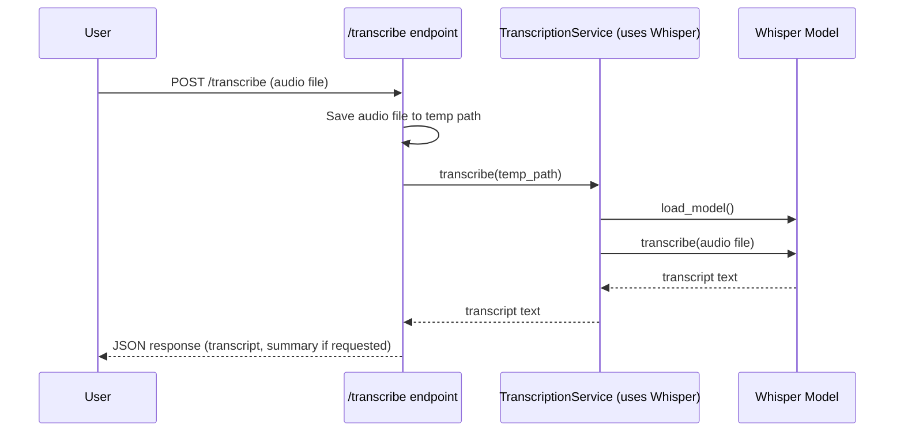

# Scribsy API & Codebase Documentation

## Project Overview

Scribsy is a modular FastAPI backend for audio transcription and AI-powered SOAP note generation. It supports user authentication, note management, and integrates with OpenAI Whisper and GPT models for transcription and summarization.

---

## Table of Contents

1. [app/main.py](#1-appmainpy)
2. [app/api/endpoints/transcribe.py](#2-appapiendpointstranscribepy)
3. [app/api/endpoints/notes.py](#3-appapiendpointsnotespy)
4. [app/api/endpoints/auth.py](#4-appapiendpointsauthpy)
5. [app/services/transcription.py](#5-appservicestranscriptionpy)
6. [app/services/ai_summary.py](#6-appservicesai_summarypy)
7. [app/crud/notes.py](#7-appcrudnotespy)
8. [app/db/models.py](#8-appdbmodelspy)
9. [app/db/schemas.py](#9-appdbschemaspy)
10. [app/db/database.py](#10-appdbdatabasepy)
11. [Endpoints and Services: How They Work Together](#endpoints-and-services-how-they-work-together)

---

## Endpoints and Services: How They Work Together

**Endpoints** (API routes) are the entry points for user and client requests. They:
- Receive HTTP requests (e.g., file uploads, note creation)
- Validate and parse input
- **Call services** to perform the main business logic (like transcription or summarization)
- Return the result to the user

**Services** are modules or classes that contain the core business logic or specialized functionality. They:
- Do the heavy lifting (e.g., transcribe audio, summarize text, interact with AI models)
- Are reusable and can be called from multiple endpoints
- Can be tested independently of the API layer

### Example Flow: /transcribe Endpoint

1. User uploads audio to `/transcribe`.
2. The endpoint saves the file and calls the **transcription service**:
   ```python
   transcript = await transcription_service.transcribe(Path(temp_path))
   ```
3. The **service** loads the Whisper model and transcribes the audio.
4. The endpoint returns the transcript (and summary if requested) to the user.

**Diagram:**


---

## 1. app/main.py

**Purpose:** Entry point for the FastAPI application. Sets up the app, CORS, and includes all API routers.

- **Routers included:**
  - `/transcribe` (audio transcription)
  - `/notes` (note management)
  - `/auth` (user authentication)
- **CORS:** Enabled for all origins (adjust for production).
- **Environment:** Loads environment variables (e.g., OpenAI API key).

**How to run:**
```bash
uvicorn app.main:app --reload
```

---

## 2. app/api/endpoints/transcribe.py

**Purpose:** Defines the `/transcribe` API endpoint for audio transcription and optional SOAP note summarization.

### Endpoint: `POST /transcribe`
- **Description:** Upload an audio file and receive a transcript. Optionally, get a structured SOAP note summary.
- **How it works:**
  - The endpoint receives the audio file and optional summarize flag.
  - It saves the file and calls the **transcription service** (see [app/services/transcription.py](#5-appservicestranscriptionpy)) to transcribe the audio.
  - If summarization is requested, it calls the **AI summary service** (see [app/services/ai_summary.py](#6-appservicesai_summarypy)).
  - The endpoint returns the transcript (and summary if requested) to the user.
- **Parameters:**
  - `file`: (form-data, required) Audio file to transcribe.
  - `summarize`: (query, optional, default: false) If true, returns a SOAP note summary.
- **Returns:**
  - `transcript`: The raw transcription of the audio.
  - `summary`: (if requested) A structured SOAP note summary (see ai_summary.py).
- **Authentication:** Not required.

**Example Request:**
```bash
curl -X POST "http://127.0.0.1:8000/transcribe?summarize=true" \
  -F "file=@your-audio-file.mp3"
```

**Example Response:**
```json
{
  "transcript": "Patient reports chest pain for two days, worse with exertion.",
  "summary": {
    "subjective": "Patient reports chest pain for two days, worse with exertion.",
    "objective": "No abnormal findings on exam.",
    "assessment": "I think this is likely angina.",
    "plan": "We'll order an ECG and start aspirin."
  }
}
```

---

## 3. app/api/endpoints/notes.py

**Purpose:** Defines the `/notes` API endpoints for CRUD operations on clinical notes. All endpoints require authentication.

### Endpoints:

- **POST `/notes/`**
  - Create a new note for the authenticated provider.
  - Request body: `NoteCreate` schema.
  - Returns: `NoteRead` schema.

- **GET `/notes/`**
  - Retrieve a list of notes for the authenticated provider.
  - Supports filtering by patient, visit, type, status, and date range.
  - Returns: List of `NoteRead` schemas.

- **GET `/notes/{note_id}`**
  - Retrieve a specific note by ID.
  - Returns: `NoteRead` schema.

- **PUT `/notes/{note_id}`**
  - Update a specific note by ID.
  - Request body: `NoteUpdate` schema.
  - Returns: `NoteRead` schema.

- **DELETE `/notes/{note_id}`**
  - Delete a specific note by ID.
  - Returns: `{ "ok": true }` if successful.

**Authentication:** All endpoints require a valid JWT Bearer token.

---

## 4. app/api/endpoints/auth.py

**Purpose:** Defines the `/auth` API endpoints for user registration, login, and user info.

### Endpoints:

- **POST `/auth/register`**
  - Register a new user.
  - Request body: `UserCreate` schema (username, password).
  - Returns: `UserRead` schema.

- **POST `/auth/token`**
  - Obtain a JWT access token for authentication.
  - Request body: OAuth2PasswordRequestForm (username, password).
  - Returns: `Token` schema (access_token, token_type).

- **GET `/auth/me`**
  - Get details of the currently authenticated user.
  - Returns: `UserRead` schema.

**Authentication:** Only `/auth/me` requires authentication.

---

## 5. app/services/transcription.py

**Purpose:** Provides the transcription service using OpenAI Whisper. This service is called by the `/transcribe` endpoint to perform the actual audio-to-text transcription.

### `TranscriptionService` class
- **`__init__(model_size: str = "base")`**: Loads the Whisper model.
- **`async transcribe(audio_path: Path) -> str`**: Transcribes an audio file using the loaded model.

**Usage Example:**
```python
from app.services.transcription import transcription_service
transcript = await transcription_service.transcribe(Path("audio.wav"))
```

---

## 6. app/services/ai_summary.py

**Purpose:** Provides the AI-powered SOAP note summarization service using OpenAI GPT. This service is called by the `/transcribe` endpoint if summarization is requested.

### `NoteSummary` (Pydantic Model)
- `subjective: str`
- `objective: str`
- `assessment: str`
- `plan: str`

### `summarize_note(user_message: str) -> NoteSummary`
- Summarizes a transcript into a SOAP note by extracting what the doctor says (does not predict or infer clinical content).
- Returns a `NoteSummary` object.

**Usage Example:**
```python
from app.services.ai_summary import summarize_note
summary = summarize_note("Patient reports chest pain for two days...")
print(summary.subjective)
```

---

## 7. app/crud/notes.py

**Purpose:** Contains CRUD operations for notes and user authentication helpers.

### Main Functions:
- `create_note(db, note)`: Create a new note.
- `get_note(db, note_id)`: Retrieve a note by ID.
- `get_notes(db, ...)`: Retrieve a list of notes with filters.
- `update_note(db, note_id, note)`: Update an existing note.
- `delete_note(db, note_id)`: Delete a note by ID.
- `get_user_by_username(db, username)`: Get a user by username.
- `create_user(db, user, hashed_password)`: Create a new user.
- `get_user(db, user_id)`: Get a user by ID.
- `verify_password(plain_password, hashed_password)`: Verify a password.
- `get_password_hash(password)`: Hash a password.
- `authenticate_user(db, username, password)`: Authenticate a user.

---

## 8. app/db/models.py

**Purpose:** Defines the SQLAlchemy ORM models for the database.

### Models:
- **`Note`**
  - `id: int`
  - `patient_id: int`
  - `provider_id: int`
  - `visit_id: int`
  - `note_type: str` (type/category of note, e.g., SOAP, progress, discharge)
  - `content: str`
  - `created_at: datetime`
  - `updated_at: datetime`
  - `signed_at: datetime | None`
  - `status: str`
  - `audio_file: str | None` (path or URL to uploaded audio file)
  - `user: relationship to User`
- **`User`**
  - `id: int`
  - `username: str`
  - `hashed_password: str`
  - `is_active: int`

---

## 9. app/db/schemas.py

**Purpose:** Defines Pydantic schemas for request/response validation.

### Note Schemas:
- `NoteBase`: Base fields for a note.
- `NoteCreate`: Inherits from `NoteBase` (for creation).
- `NoteUpdate`: All fields optional (for updates).
- `NoteRead`: Inherits from `NoteBase`, adds `id`, `created_at`, `updated_at`.

### User Schemas:
- `UserBase`: `username`
- `UserCreate`: Inherits from `UserBase`, adds `password`
- `UserRead`: Inherits from `UserBase`, adds `id`, `is_active`
- `Token`: `access_token`, `token_type`

---

## 10. app/db/database.py

**Purpose:** Sets up the database connection and session management.

- **`init_db()`**: Create all tables in the database.
- **`get_db()`**: Dependency for getting a database session (used with FastAPI's `Depends`).
- **Configuration:** Uses SQLite by default, but can be configured via the `DATABASE_URL` environment variable.

---

If you need more detail on any file or want a visual diagram, let me know! 